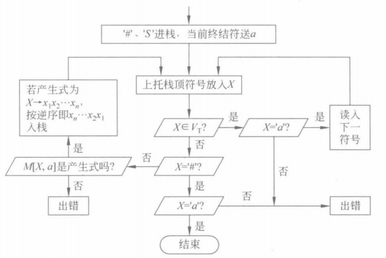
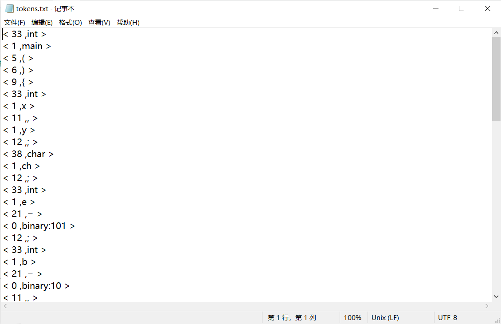
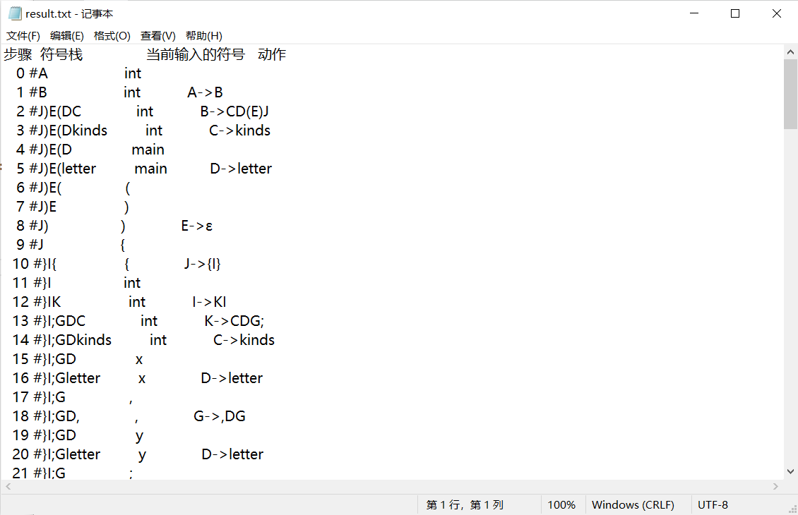
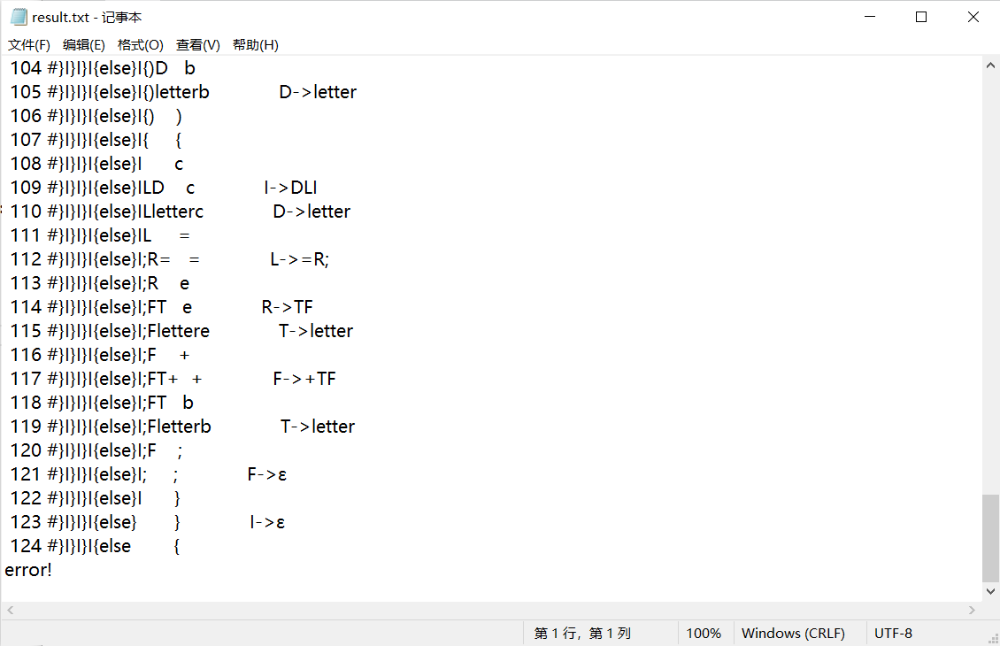

# 语法分析器 Syntactic Parser
**学号：19335182**
**姓名：唐晨轩**

## 1. 实验要求 
用LL(1)分析法和LR(0)分析法两种方法设计实现算术表达式的语法分析器。
实现对词法分析程序所提供的单词序列的语法 检查和结构分析。

## 2. 实验过程
受种种因素影响，只完成了 LL(1) 分析法的语法分析器。

### 2.1 待分析的语言语法 
首先，根据 c 语言文法消除左递归，简化优化为 LL(1) 文法后设计自定义文法 
产生式如下:(当前文法以英文为准，汉字为 c 语言文法) (来源于他人的研究成果)
```c
1,A->B <源程序>→<函数体>//zwx：为了降低难度，暂时不考虑外部声明和程序外声明情况
2,B->CD(E)J <函数体>→<数据类型><标识符>（<形参>）<复合语句>
3,C->kinds <数据类型>→void|char|int|float|double|long
4,D->letter|digit <标识符>→<字符串>|<数字> //zwx：实际意义并非标识符
5,G->,DG|=DG|ε
6,F->+TF|-TF|*TF|\TF|ε
7,E->CDG|ε <形参>→<数据类型> <标识符><G>|ε
8,J->{I} <复合语句>→{ <语句列表>}
9,I->KI|DLI|MI|NI|QI|ε <语句列表>→<声明语句><语句列表>|<赋值语句|单运算符语句><语句列表>|<条件语句><语句列表>|<循环语句><语句列表>|<跳转语句><复合语句>|ε
10,Q->break;|continue;|return R; <跳转语句>→ break;|continue;|return <表达式>;
11,K->CDG;<声明语句>→<数据类型><标识符>;
12,L->=R;|X;<赋值|单运算符语句>→<标识符>=<表达式>;
13,R->TF <表达式>
14,T->letter|digit F→表达式|标识符|数字|字符串
15,M->if(U){I}else{I} <条件语句>→if( <判断语句>)<{语句列表}> else <{语句列表}>//zwx：简化了条件语句
16,U->DVD <判断语句>-><标识符><关系运算符><临时变量>
17,V-> >|<|==|<=|>=|!= <关系运算符>→>|<|==|<=|>=|!=
18,N-> O|P <循环语句>→<for语句>|<while语句>//zwx：不考虑do-while
19,O->for(DL;U;DX){I} <for语句>→for(赋值语句|声明语句;判断语句; <标识符><D>){语句列表}
20,X->++|-- <自加自减>→++|--
21,P->while(U){I} <while语句>→while(判断语句){语句列表}
```
为方便编程，定义 kinds = int | long | short | float | double | char

### 2.2 根据产生式求 FIRST 集
kinds = int | long | short | float | double | char 

| 标识符 | 非终结符   | FIRST集                                      |
| ------ | ---------- | -------------------------------------------- |
| A      | 源程序     | kinds                                        |
| B      | 函数体     | kinds                                        |
| C      | 数据类型   | kinds                                        |
| D      | 标识符     | letter,digit                                 |
| E      | 形参       | kinds，','                                   |
| G      | G          | ,，=                                         |
| I      | 语句列表   | {,ε,letter,if,for,whilebreak,continue,return |
| J      | 复合语句   | {                                            |
| K      | 声明语句   | kinds                                        |
| L      | 赋值语句   | letter                                       |
| M      | 条件语句   | if                                           |
| N      | 循环语句   | for,while                                    |
| O      | for语句    | for                                          |
| P      | while语句  | while                                        |
| Q      | 跳转语句   | break,continue,return                        |
| R      | 表达式     | letter，digit                                |
| T      | T          | letter，digit                                |
| F      | F          | +,-,*,/                                      |
| U      | 判断语句   | letter                                       |
| V      | 关系运算符 | <,>,!=,>=,<=,==                              |
| X      | 自加自减   | ++,--                                        |

### 2.3 follow集

| 标识符 | 非终结符        | FOLLOW集                                            |
| ------ | --------------- | --------------------------------------------------- |
| A      | 源程序          | #                                                   |
| B      | 函数体          | #                                                   |
| C      | 数据类型        | letter,digits                                       |
| D      | 标识符          | letter,digits,=,(,<,>,!=,>=,<=,==,\|\|,&&,!,;,++,-- |
| E      | 形参            | ,  ）                                               |
| G      | G               |                                                     |
| H      | 数字//zwx：同上 | kinds,letter,digits,=,(,<,>,!=,>=,<=,==,\|\|,&&,!   |
| I      | 语句列表        | }                                                   |
| J      | 复合语句        | #                                                   |
| K      | 声明语句        | {,ε,letter,if,for,while,break,continue,return,}     |
| L      | 赋值语句        | {,ε,letter,if,for,while,break,continue,return,}     |
| M      | 条件语句        | {,ε,letter,if,for,while,break,continue,return,}     |
| N      | 循环语句        | {,ε,letter,if,for,while,break,continue,return,}     |
| O      | for语句         | {,ε,letter,if,for,while,break,continue,return,}     |
| P      | while语句       | {,ε,letter,if,for,while,break,continue,return,}     |
| Q      | 跳转语句        | {,ε,letter,if,for,while,break,continue,return,}     |
| R      | 表达式          | +,-,*,/                                             |
| T      | T               | +,-,*,/                                             |
| F      | F               | *,/,+,-                                             |
| U      | 判断语句        | )                                                   |
| V      | 关系运算符      | digit,letter                                        |
| X      | 自加自减        | )                                                   |

### 2.4 预测分析表

|       | kinds:67  | 0:digit  | 1:letter  | 5:(  | 6:)  | 9:{    | 10:} | 11:,   | 12:; | 47:if              | 54:for             | 53:while       | 56:break  | 55:continue  | 57:return    | 3:<  | 4:>  | 27:<= | 26:>= | 29:!= | 28:\== | 21:\=  | 22:\++ | 23:\-- | 13:+   | 14:-   | 15:*   | 16:/   |
| ----- | --------- | -------- | --------- | ---- | ---- | ------ | ---- | ------ | ---- | ------------------ | ------------------ | -------------- | --------- | ------------ | ------------ | ---- | ---- | ----- | ----- | ----- | ------ | ------ | ------ | ------ | ------ | ------ | ------ | ------ |
| A:100 | A->B      |          |           |      |      |        |      |        |      |                    |                    |                |           |              |              |      |      |       |       |       |        |        |        |        |        |        |        |        |
| B:101 | B->CD(E)J |          |           |      |      |        |      |        |      |                    |                    |                |           |              |              |      |      |       |       |       |        |        |        |        |        |        |        |        |
| C:102 | C->kinds  |          |           |      |      |        |      |        |      |                    |                    |                |           |              |              |      |      |       |       |       |        |        |        |        |        |        |        |        |
| D:103 |           | D->digit | D->letter |      |      |        |      |        |      |                    |                    |                |           |              |              |      |      |       |       |       |        |        |        |        |        |        |        |        |
| E:104 | E->CDG    |          |           |      | G->ε |        |      |        |      |                    |                    |                |           |              |              |      |      |       |       |       |        |        |        |        |        |        |        |        |
| F:105 |           |          |           |      |      |        |      |        | F->ε |                    |                    |                |           |              |              |      |      |       |       |       |        |        |        |        | F->+TF | F->-TF | F->*TF | F->/TF |
| G:106 |           |          |           |      | G->ε |        |      | G->,DG | G->ε |                    |                    |                |           |              |              |      |      |       |       |       |        | \=DG   |        |        |        |        |        |        |
| I:108 | I->KI     |          | I->DLI    |      |      |        | I->ε |        |      | I->MI              | I->NI              | I->NI          | I->QI     | I->QI        | I->QI        |      |      |       |       |       |        |        |        |        |        |        |        |        |
| J:109 |           |          |           |      |      | J->{I} |      |        |      |                    |                    |                |           |              |              |      |      |       |       |       |        |        |        |        |        |        |        |        |
| K:110 | K->CDG;   |          |           |      |      |        |      |        |      |                    |                    |                |           |              |              |      |      |       |       |       |        |        |        |        |        |        |        |        |
| L:111 |           |          |           |      |      |        |      |        |      |                    |                    |                |           |              |              |      |      |       |       |       |        | L->=R; | I->X;  | I->X;  |        |        |        |        |
| M:112 |           |          |           |      |      |        |      |        |      | M->if(U){I}else{I} |                    |                |           |              |              |      |      |       |       |       |        |        |        |        |        |        |        |        |
| N:113 |           |          |           |      |      |        |      |        |      |                    | N->O               | N->P           |           |              |              |      |      |       |       |       |        |        |        |        |        |        |        |        |
| O:114 |           |          |           |      |      |        |      |        |      |                    | O->for(DL U;DX){I} |                |           |              |              |      |      |       |       |       |        |        |        |        |        |        |        |        |
| P:115 |           |          |           |      |      |        |      |        |      |                    |                    | P->while(U){I} |           |              |              |      |      |       |       |       |        |        |        |        |        |        |        |        |
| Q:116 |           |          |           |      |      |        |      |        |      |                    |                    |                | Q->break; | Q->continue; | Q->return R; |      |      |       |       |       |        |        |        |        |        |        |        |        |
| R:117 |           | R->TF    | R->TF     |      |      |        |      |        |      |                    |                    |                |           |              |              |      |      |       |       |       |        |        |        |        |        |        |        |        |
| T:119 |           | T->digit | T->letter |      |      |        |      |        |      |                    |                    |                |           |              |              |      |      |       |       |       |        |        |        |        |        |        |        |        |
| U:120 |           |          | U->DVD    |      |      |        |      |        |      |                    |                    |                |           |              |              |      |      |       |       |       |        |        |        |        |        |        |        |        |
| V:121 |           |          |           |      |      |        |      |        |      |                    |                    |                |           |              |              | V->< | V->> | V-><= | V->>= | V->!= | V->==  |        |        |        |        |        |        |        |
| X:123 |           |          |           |      |      |        |      |        |      |                    |                    |                |           |              |              |      |      |       |       |       |        |        | X->++  | X->--  |        |        |        |        |

### 2.5 程序流程图



## 3. 结果展示

**输入**为词法分析器的输出结果(删去了一些解释部分):
(截取部分)


**输出**如下:
(截取部分)




## 4.实验总结
本次实验的 LL(1)分析法 输出与预期一致；
可惜没用在规定时间内完成 LR(0)分析法的分析任务。
总的来说本次实验也是完成了。后续会将代码和实验报告以及输入输出样例都上传到我的Github仓库中。
https://github.com/Yuhiman7Xc/Compilation-Principle