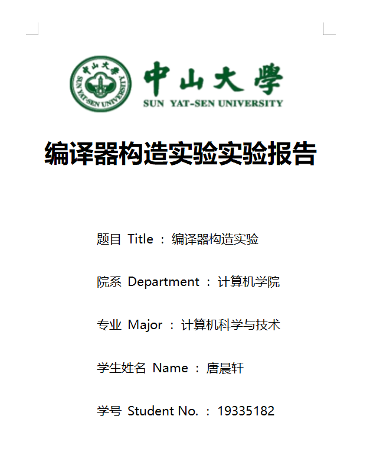
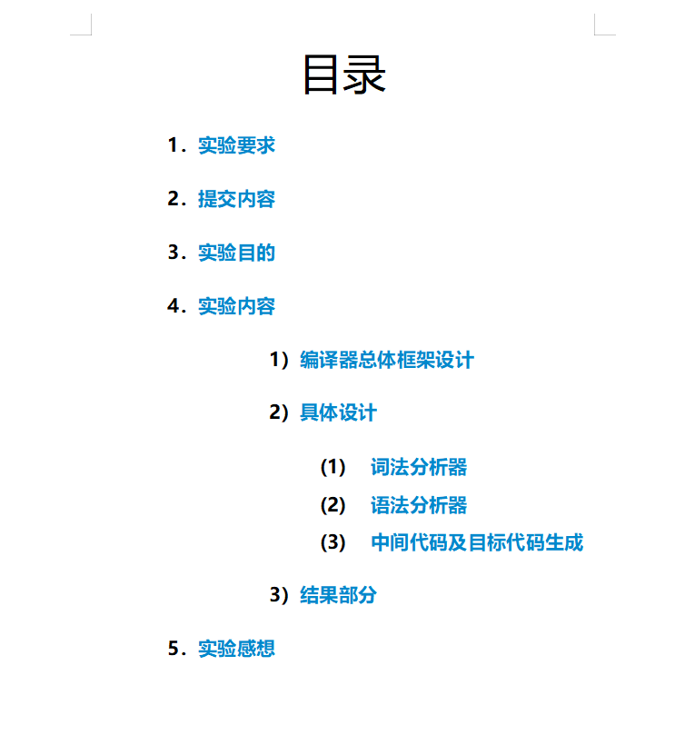
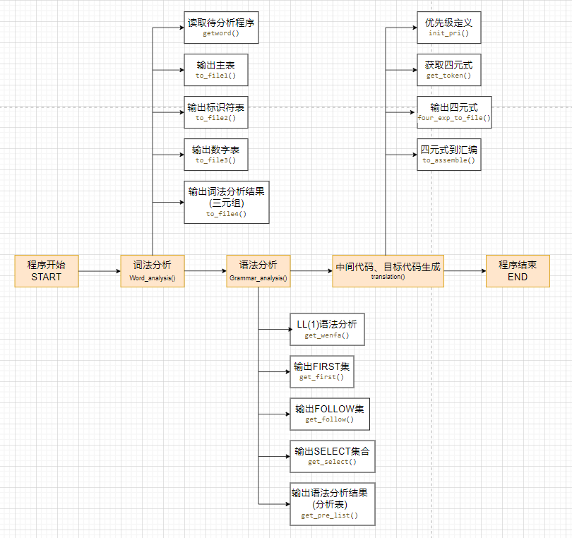
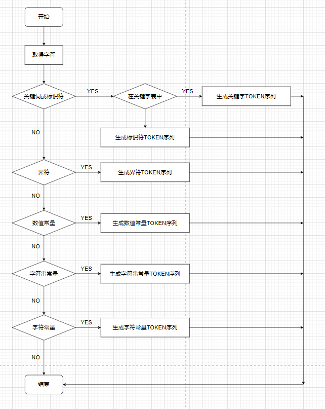
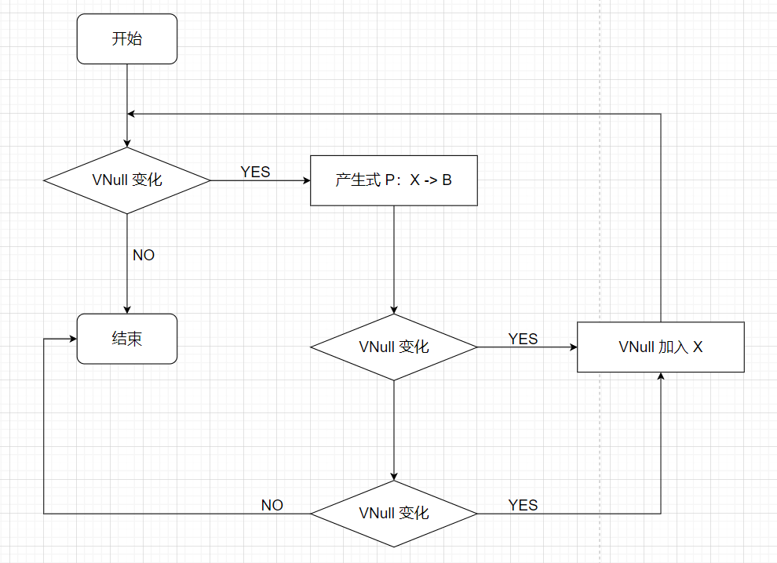
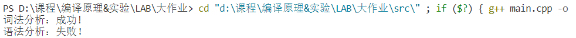
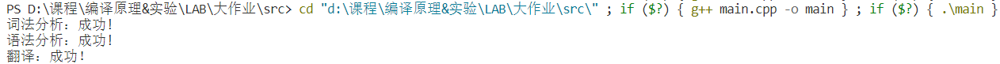
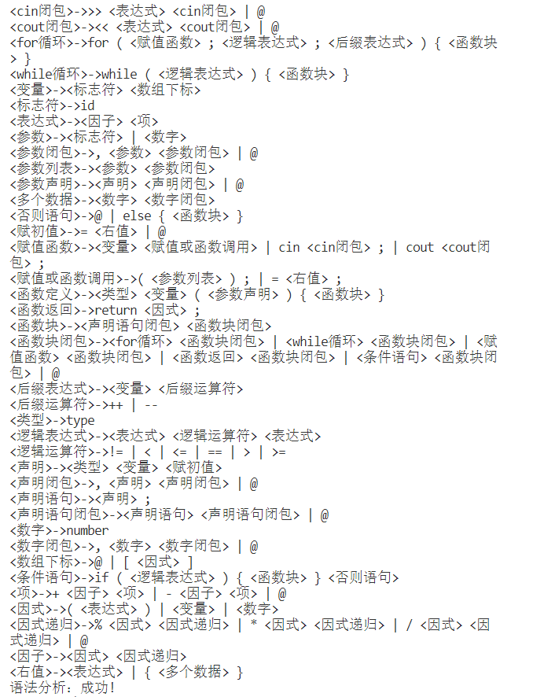

[toc]

## 一：实验要求
- 一个简单文法的编译器的设计与实现
	- 一个简单文法的编译器前段的设计与实现
		-  定义一个简单程序设计语言文法（包括变量说明语句、算术运算表达式、赋值语句；扩展包括逻辑运算表达式、If语句、While语句等）；
		- 扫描器设计实现；
		- 符号表系统的设计实现；
		- 语法分析器设计实现；
		- 中间代码设计；
		- 中间代码生成器设计实现。
	- 一个简单文法的编译器后段的设计与实现
		- 中间代码的优化设计与实现（鼓励）；
		- 目标代码的生成（使用汇编语言描述，指令集自选）；
		- 目标代码的成功运行。

## 二：提交内容
- 要求以个人为单位，提交压缩包，包括以下内容：
	- 设计报告
	- 源代码压缩包
	- 可执行文件
	- 源码测试文件（待编译的程序，程序必须覆盖所支持的文法单元）
	- 测试输出文件（目标代码文件）
	- readme.txt（程序复现说明书)

## 三：实验目的
- 通过编译器相关子系统的设计，进一步加深对编译器构造的理解；
- 培养学生独立分析问题、解决问题的能力，以及系统软件设计的能力；
- 提高程序设计能力、程序调试能力

## 四：实验内容

### 1. 编译器总体框架设计

&emsp;经过多次的考虑和修改，最终确定下来本编译器总体架构的架构示意图如下图所示：



(draw.io文件在../img文件夹下)

- 程序开始：从main.cpp开始运行程序；
- 词法分析：返回词法分析结果true/false；
  - 读取待分析程序：从programe.txt读入待分析程序；
  - 输出主表：输出主表到main_table.txt；
  - 输出标识符表：输出标识符表到id_table.txt；
  - 输出数字表：输出数字表到number_table.txt；
  - 输出词法分析结果(三元式)：输出经词法分析得到存有各词法元素的三元式，存在twox.txt中；
- 语法分析：返回语法分析结果true/false；
  - LL(1)语法分析：从grammar.txt读入语法规则；
  - 输出FIRST集：输出FIRST集到FIRST.txt；
  - 输出FOLLOW集：输出FOLLOW集到FOLLOW.txt；
  - 输出SELECT集：输出SELECT集到SELECT.txt；
  - 输出语法分析结果(分析表)：输出分析表到pre_list.txt，分析过程到process.txt；
- 中间代码、目标代码生成：返回中间代码、目标代码生成结果true/false；
  - 优先级定义：定义运算符号等的优先级；
  - 获取四元式
  - 输出四元式：输出四元式到four_exp.txt；
  - 四元式到汇编：输出汇编指令到assemble.txt；
- 程序结束：END

&emsp;编译器整体围绕 struct.h 文件展开，在 struct.h 文件中，存放了大量全局参数以及自定义的数据类型，比如四元式，数字结构体，词法node等等。

&emsp;编译器前端大致可分为三个部分：词法分析，语法分析以及中间代码和目标代码生成。 

&emsp;我将词法分析，语法分析以及中间代码和目标代码生成三个部分分别在 word_analysis.h , grammar_analysis.h , translation.h 中编写，这样使得程序整体更加有序，也会减少不同任务之中可能存在的一些冲突隐患。总的来说降低了编程的复杂性。

&emsp;词法分析器将从 programe.txt 中读入 string 流，将分析结果保存在如下自定义结构体中：

```c++
//词法
typedef struct node{
    string value;
    string type;
    int number;
}pro;
vector<pro> watest;
```

&emsp;语法分析器使用的是LL(1)分析法，将语法动作插入到产生式中，输出 FIRST , FOLLOW , SELECT 集和具体分析过程。

&emsp;LL(1)分析法负责识别结构较为简单，但是需要处理较多细节的部分，如算数表达式，逻辑表达式。由于此处在编码时可能涉及到较多的修改，为了降低修改语法所带来的大量代码修改。在此处实现了LL(1)分析表的自动生成，修改语法仅需要修改储存文法的文件即可，不需要对分析器本身进行修改。而且，分析表的自动生成可以实现复杂的算数逻辑表达式，能够使语言具有更强的可用性。在语义分析上采用了属性文法的方法，在归约时执行语义动作。

&emsp;编译器后端包括中间代码生成和目标代码生成。

&emsp;后端大致思路为，将前端四元式用接口函数转换为后端待处理四元式的数据结构。接下来目标代码生成算法处理此序列得到目标汇编指令。其中，目标代码生成采用多寄存器分配方法，首先分配寄存器，处理操作数寻址方式，并生成对应的目标代码，然后生成运算部分的目标代码。处理了很多算法细节使算法更加健壮完备，生成的代码是基于Intel X86的汇编指令。


### 2. 具体设计

**语法规则**如下：

```txt
<函数定义> -> <类型> <变量> ( <参数声明> ) { <函数块> }
<类型> -> type
<变量> -> <标志符> <数组下标>
<标志符> -> id
<数组下标> -> [ <因式> ] | @
<因式> -> ( <表达式> ) | <变量> | <数字>
<数字> -> number
<表达式> -> <因子> <项>
<因子> -> <因式> <因式递归>
<因式递归> -> * <因式> <因式递归> | / <因式> <因式递归> | % <因式> <因式递归> | @
<项> -> + <因子> <项> | - <因子> <项> | @
<参数声明> -> <声明> <声明闭包> | @
<声明> -> <类型> <变量> <赋初值>
<赋初值> -> = <右值> | @
<右值> -> <表达式> | { <多个数据> }
<多个数据> -> <数字> <数字闭包>
<数字闭包> -> , <数字> <数字闭包> | @
<声明闭包> -> , <声明> <声明闭包> | @
<函数块> -> <声明语句闭包> <函数块闭包>
<声明语句闭包> -> <声明语句> <声明语句闭包> | @
<声明语句> -> <声明> ;
<函数块闭包> -> <赋值函数> <函数块闭包> | <for循环> <函数块闭包> | <条件语句> <函数块闭包> | <函数返回> <函数块闭包> | <while循环> <函数块闭包> | @
<赋值函数> -> <变量> <赋值或函数调用> | cin <cin闭包> ; | cout <cout闭包> ;
<cin闭包> -> >> <表达式> <cin闭包> | @
<cout闭包> -> << <表达式> <cout闭包> | @
<赋值或函数调用> -> = <右值> ; | ( <参数列表> ) ;
<参数列表> -> <参数> <参数闭包>
<参数闭包> -> , <参数> <参数闭包> | @
<参数> -> <标志符> | <数字>
<for循环> -> for ( <赋值函数> ; <逻辑表达式> ; <后缀表达式> ) { <函数块> }
<while循环> -> while ( <逻辑表达式> ) { <函数块> }
<逻辑表达式> -> <表达式> <逻辑运算符> <表达式>
<逻辑运算符> -> < | > | == | != | >= | <=
<后缀表达式> -> <变量> <后缀运算符>
<后缀运算符> -> ++ | --
<条件语句> -> if ( <逻辑表达式> ) { <函数块> } <否则语句>
<否则语句> -> else { <函数块> } | @
<函数返回> -> return <因式> ;
```

词法分析可识别标识符**符号表**如下：

```c++
//保留字
string key_word[n_key] = {"auto", "enum", "restrict", "unsigned", "break",
                    "extern", "return", "void", "case", "float",
                    "short", "volatile", "char", "for", "signed",
                    "while", "const", "goto", "sizeof", "_Bool",
                    "continue", "if", "static", "_Complex", "default",
                    "inline", "struct", "_Imaginary", "do", "int",
                    "switch", "double", "long", "typedef", "else",
                    "register", "union", "scanf", "printf", "cin",
                    "cout"
};

//操作符
string oper[] = {"+", "-", "*", "/", "^",
                "<", ">", "++", "--", "==",
                "*=", "/=", ">=", "<=", "<<",
                ">>", ">>=", "<<=", "%", "&",
                "^"
};

//界符
char bound[] = {',', ';', '(', ')', '[', ']', '{', '}'};

//标识符

//数字
int my_stoi(string s){                         //get int
    int ans = 0;
    for(int i=0; i<s.size(); i++) ans = ans * 10 + s[i] - '0';
    return ans;
}

double my_stof(string s){                      //get double
    long long ans = 0;
    int fd = -1, fe = -1;
    for(int i=0; i<s.size(); i++){
        if(s[i] == '.'){
            fd = i;
            continue;
        }
        if(s[i] == 'e'){
            fe = i;
            continue;
        }
        ans = ans * 10 + s[i] - '0';
    }
    if(fd != -1 && fe == -1) return double(ans)/(pow(10, s.size() - fd - 1));
    else if(fd == -1 && fe != -1){
        long long temp = ans % (long long)pow(10, s.size() - fe - 1);     //得到e后的数字
        ans /= pow(10, s.size() - fe - 1);                          //得到e前的数字
        return double(ans*pow(10, temp));
    }
    else{
        long long temp = ans % (long long)pow(10, s.size() - fe - 1);     //得到e后的数字
        cout<<ans<<" "<<s.size() - fe - 1<<" "<<temp<<endl;
        ans /= pow(10, s.size() - fe - 1);                                //得到e前的数字
        cout<<ans<<endl;
        long long tt = (s.size() - fd - 1) - (s.size() - fe - 1) - 1;     //得到.后的数字
        cout<<tt<<endl;
        return (double)ans/pow(10, tt) * (pow(10, temp));
    }
}
```

**目标代码指令集**介绍如下：

对应部分 X86 指令

|原语言 | 目标代码指令集|
|------|------|
| = | MOV |
| cin | IN |
| cout | OUT |
| + | MOV |
|   | ADD |
|   | MOV |
| - | MOV |
|   | SUB |
|   | MOV |
| * | MOV |
|   | MUL |
|   | MOV |
| / | MOV |
|   | DIV |
|   | MOV |
| % | MOV |
|   | MOD |
|   | MOV |
| > | CMP |
|   | JG  |
|   | MOV |
|   | MOV |
| < | CMP |
|   | JNG |
|   | MOV |
|   | MOV |
| J=| CMP |
|   | JZ  |

具体实现见 translation.h 文件中的 to_assemble() 函数。

#### 2.1 词法分析器

**2.1.1 功能**

&emsp;词法分析器主要功能是为语法分析器提供 TOKEN 串。该部分相关代码在 word_analysis.h 。词法分析器将准备编译的源代码作为输入，实现对语句的分词功能。根据终结状态将分词划分为六类：保留字(关键字)、标识符、界符、常数常量、字符常量和字符串常量。最后再生成对应的 TOKEN 串。将结果存储在准备好的相应的数据结构中。

**2.2.2 数据结构**

词法分析相关数据结构如下：

```c++
const int maxn = 1002;
const int n_key = 41;           //保留字数目
const int n_oper = 21;          //操作符数目
char c;

//保留字
string key_word[n_key] = {"auto", "enum", "restrict", "unsigned", "break",
                    "extern", "return", "void", "case", "float",
                    "short", "volatile", "char", "for", "signed",
                    "while", "const", "goto", "sizeof", "_Bool",
                    "continue", "if", "static", "_Complex", "default",
                    "inline", "struct", "_Imaginary", "do", "int",
                    "switch", "double", "long", "typedef", "else",
                    "register", "union", "scanf", "printf", "cin",
                    "cout"
};

//操作符
string oper[] = {"+", "-", "*", "/", "^",
                "<", ">", "++", "--", "==",
                "*=", "/=", ">=", "<=", "<<",
                ">>", ">>=", "<<=", "%", "&",
                "^"
};

//界符
char bound[] = {',', ';', '(', ')', '[', ']', '{', '}'};

//词结构体
struct Word{
    int id;
    string value;
};

//数字结构体
struct Num{
    int id;
    int vi;
    double vd;
};

Num n[maxn];            //数字
Word w[maxn];           //词
map<string, int> m;     //标识符
int f = 0, ff = 0;

//词法
typedef struct node{
    string value;
    string type;
    int number;
}pro;
vector<pro> watest;
```

**2.2.3 词法分析器的具体流程**

**词法分析器的具体流程**如下：



对应的主体代码为：

&emsp;代码中有详细注释，标注了判别判断分词是否属于关键字或标识符，常数常量，界符常量，字符串常量和字符常量的具体思路。

```c++
void getword(){
    freopen("./input/programe.txt", "r", stdin);                //重定向

    string str = "";                                    //当前字符串
    int flag, is_end;
    is_end = scanf("%c", &c);
    while(is_end != EOF){                               //遍历输入文件
        flag = 0;
        if(isspace(c)){                                 //如果当前字符是空格
            while(isspace(c) && is_end != EOF){         //滤空格
                is_end = scanf("%c", &c);
            }
        }
        if(isalpha(c) || c == '_'){                     //如果当前字符以字母或下划线开头
            while(isalnum(c) || c == '_' || isalpha(c)){
                str += c;                               //当前字符串
                is_end = scanf("%c", &c);
            }
            w[++f].value = str;
            if(is_key(str)){                            //当前字符串为保留字
                w[f].id = 1;
                if(str == "int" || str == "float" || str == "long" || str == "double" || str == "char" || str == "bool")
                    watest.push_back(pro{str, "type", 1});
                else watest.push_back(pro{str, str, 1});
            }       
            else{                                       //当前字符串为标识符
                w[f].id = 2;                     
                m[str] ++;
                watest.push_back(pro{str, "id", 2});
            }
            str = "";
            flag = 1;
        }
        if(isdigit(c)){                                 //当前字符为数字
            int fd = 0, fe = 0, fflag = 0;
            while(isdigit(c) || c == '.' || c == 'e'){
                if(c == '.') fd ++;
                if(c == 'e') fe ++;
                if(c == '.' && fe) fflag = 1;
                str += c;
                is_end = scanf("%c", &c);
            }
            if(str[str.size()-1] == '.' || str[str.size()-1] == 'e') fflag = 1;
            if(fflag){
                cout<<"错误-->不合法数字："<<str<<endl;    //忽略不合法输入
            }
            else{
                watest.push_back(pro{str, "number", 3});
                if(!fd && !fe){
                    n[++ff].vi = my_stoi(str);
                    n[ff].id = 1;
                }
                else{
                    n[++ff].vd = my_stof(str);
                    n[ff].id = 2;
                }
                w[++f].id = 3;  w[f].value = str;
            }
            str = "";
            flag = 1;
        }
        if(is_bound(c)){                                //当前字符为界符
            str += c;
            w[++f].value = str;
            w[f].id = 4;

            watest.push_back(pro{str, str, 4});

            is_end = scanf("%c", &c);
            str = "";
            flag = 1;
        }
        string ss = "";
        ss += c;
        if(is_oper(ss)){                                //当前字符为操作符
            while(is_oper(ss)){
                str += c;
                is_end = scanf("%c", &c);
                ss += c;
            }
            if(is_oper(str)){
                w[++f].value = str;
                w[f].id = 5;

                watest.push_back(pro{str, str, 5});
            }
            str = "";
            flag = 1;
        }
        if(!flag && is_end != EOF){
            str += c;
            w[++f].value = str;
            w[f].id = 6;

            watest.push_back(pro{str, str, 6});

            is_end = scanf("%c", &c);
            str = "";
        }
    }
    freopen("CON", "r", stdin);           //关闭重定向,恢复标准
}
```

#### 2.2 语法分析器

**2.2.1 功能**

&emsp;输入为词法分析器产生的分析结果，已经存储在了相应的数据结构中。该部分相关代码在 grammar_analysis.h 。通过对文法的解析，自动生成First，Follow，Select等集合，进而有Select集合自动构建 LL(1) 分析表，根据自动生成的 LL(1) 分析表，进行语法分析，以及为后续的四元式产生及目标代码生成做前置准备工作。语法分析的同时可以利用符号表中的信息进行类型检查。

**2.2.2 数据结构**

```c++
//语法
typedef pair<string, string> P;
map<P, string> pre_list;
typedef set<string> Sets;
map<string, Sets> first, follow, wenfa, select;      //first, follow
Sets Term, Nterm;                //终极符，非终极符
string Start;
```

**2.2.3 算法**

求推出空的非终结符集合 VNULL (也就是待分析部分)

算法思想：

非终结符 X 属于集合 VNULL，当且仅当：

&emsp;基本情况：

&emsp; X -> 空

&emsp; 归纳情况:

&emsp; X -> Y<sub>1</sub> … Y<sub>n</sub>

&emsp; Y<sub>1</sub>, …, Y<sub>n</sub> 是 n 个非终结符，且都属于 VNULL 集


**语法分析器的具体流程**演示如下：




**求 First 集合：**

算法思想：

&emsp; X -> a

&emsp; FIRST (X) ∪= {a}

&emsp; 归纳情况：

&emsp; X -> Y1 Y2 … Yn

&emsp; FIRST (X) ∪= FIRST(Y1)

&emsp; if Y1  NULLABLE, FIRST (X) ∪= FIRST(Y2)

&emsp; if Y1,Y2  NULLABLE, FIRST(X) ∪= FIRST(Y3)

伪代码：

```txt
NULLABLE = {};
while (NULLABLE is still changing)
    foreach (production p: X->β)
        if (β == 空)
            NULLABLE ∪= {X}
        if (β == Y1 … Yn)
            if (Y1属于NULLABLE && … && Yn属于NULLABLE)
                NULLABLE ∪= {X}
```


具体代码如下：

```c++
void get_first(){
    int flag = 1;
    Sets tt;
    while(flag){
        flag = 0;
        for(map<string, Sets>::iterator it = wenfa.begin(); it != wenfa.end(); it ++){    //所有非终结符
            string X = it->first;       //对于非终结符X

            if(wenfa[X].count("@") && !first[X].count("@")){   //包含@，加入FIRST
                first[X].insert("@");
                flag = 1;
            }

            for(Sets::iterator f = wenfa[X].begin(); f != wenfa[X].end(); f ++){    //遍历s所有产生式
                string foo = *f, str = "", last = "";                               //对于产生式X->Y1Y2Y3...

                int i = 0;
                while(foo[i] != ' ' && i < foo.size()) str += foo[i ++];    //找到Y1
                if(str == "") continue;

                if(!(str[0] == '<' && str[str.size()-1] == '>')){     //Y1是终结符
                    if(!first[X].count(str)){
                        first[X].insert(str);
                        flag = 1;
                    }
                    if(str != "@") continue;      //是终结符但不是@
                }
                else{     //Y1是非终结符
                    for(Sets::iterator ii = first[str].begin(); ii != first[str].end(); ii ++){
                        if(*ii != "@" && !first[X].count(*ii)){
                            first[X].insert(*ii);
                            flag = 1;
                        }
                    }
                    if(!first[str].count("@")) continue;
                }

                for( ; i<foo.size(); i++){
                    if(foo[i] != ' '){
                        last = str;
                        str = "";
                        while(foo[i] != ' ' && i < foo.size()) str += foo[i ++];

                        if(last == "@" || first[last].count("@")){
                            for(Sets::iterator ii = first[str].begin(); ii != first[str].end(); ii ++){
                                if(*ii != "@" && !first[X].count(*ii)){
                                    first[X].insert(*ii);
                                    flag = 1;
                                }
                            }
                        }
                        else break;
                    }
                }

                if(i >= foo.size() && (str == "@" || first[str].count("@"))){                          //Y1Y2Y3...Yn的FIRST都可产生@
                    if(!first[X].count("@")){
                        first[X].insert("@");
                        flag = 1;
                    }
                }
            }
        }
    }

    //输出FIRST集
    fstream out;
    out.open("./output/FIRST.txt", ios::out);       //输出保存FIRST
    for(map<string, Sets>::iterator t = first.begin(); t != first.end(); t ++){
        out<<"FIRST("<<t->first<<"): ";
        for(Sets::iterator it = t->second.begin(); it != t->second.end(); it ++)
            out<<" "<<*it;
        out<<endl;
    }
    out.close();
}
```

**求 Follow 集合：**

伪代码：

```txt
foreach (nonterminal N)
	FOLLOW(N) = {}
while(some set is changing)
foreach (production p: N->β1 … βn)
	temp = FOLLOW(N)
	foreach (βi from βn downto β1) // 逆序！
		if (βi== a …)
			temp = {a}
		if (βi== M …)
			FOLLOW(M) ∪= temp
			if (M is not NULLABLE)
				temp = FIRST(M)
			else temp ∪= FIRST(M)
```

具体代码如下：

```c++
void get_follow(){
    int flag = 1;
    int cnt;
    string str, foo, s, last, tr;
    Sets tt;

    follow[Start].insert("#");   //把#加入follow(Start)

    while(flag){
        flag = 0;
        for(map<string, Sets>::iterator it = wenfa.begin(); it != wenfa.end(); it ++){
            str = it->first;                                           //对于FOLLOW(str)

            for(Sets::iterator ti = it->second.begin(); ti != it->second.end(); ti ++){
                foo = *ti;                                      //对于产生式str->foo即str->ABC

                int len = foo.size(), i = 0;
                s = "";
                while(foo[i] != ' ' && i < len){ s += foo[i ++]; }
                if(s == "") continue;

                for( ; i<len; i++){
                    if(foo[i] != ' '){
                        last = s;
                        s = "";
                        while(foo[i] != ' ' && i < len){ s += foo[i ++]; }
                        if(last[0] != '<' || last[last.size()-1] != '>') continue;  //B是终结符，往后串

                        if(s[0] != '<' || s[s.size()-1] != '>'){   //C是终结符
                            if(s != "@" && !follow[last].count(s)){
                                follow[last].insert(s);
                                flag = 1;
                            }
                            if(s != "@") continue;
                        }
                        else{    //C是非终结符，先把first(C) - {@}加入
                            for(Sets::iterator ii = first[s].begin(); ii != first[s].end(); ii ++){
                                if(*ii != "@" && !follow[last].count(*ii)){
                                    follow[last].insert(*ii);
                                    flag = 1;
                                }
                            }
                        }

                        if(first[s].count("@") || s == "@"){   //C->*@,就看后面的
                            string next = s;
                            int k = i;
                            for( ; k < len; k++){
                                if(foo[k] != ' '){
                                    next = "";
                                    while(foo[k] != ' ' && k < len){ next += foo[k ++]; }

                                    if(next[0] != '<' || next[next.size()-1] != '>'){    //next是终结符
                                        if(next != "@" && !follow[last].count(next)){
                                            follow[last].insert(next);
                                            flag = 1;
                                        }
                                        if(next != "@") break;
                                    }
                                    else{    //next是非终结符
                                        for(Sets::iterator ii = first[next].begin(); ii != first[next].end(); ii ++){
                                            if(*ii != "@" && !follow[last].count(*ii)){
                                                follow[last].insert(*ii);
                                                flag = 1;
                                            }
                                        }
                                        if(!first[next].count("@")) break;
                                    }
                                }
                            }
                            if(k >= len && (next == "@" || first[next].count("@"))){    //对于str->ABC,C->*@,则将follow(str) - {@}加到follow(B)中
                                for(Sets::iterator ii = follow[str].begin(); ii != follow[str].end(); ii ++){
                                    if(!follow[last].count(*ii)){
                                        follow[last].insert(*ii);
                                        flag = 1;
                                    }
                                }
                            }
                        }
                    }
                }
                if(i >= len && (s[0] == '<' && s[s.size()-1] == '>')){    //对于str->ABC,则将follow(str) - {@}加到follow(C)中
                    for(Sets::iterator ii = follow[str].begin(); ii != follow[str].end(); ii ++){
                        if(!follow[s].count(*ii)){
                            follow[s].insert(*ii);
                            flag = 1;
                        }
                    }
                }
            }
        }
    }

//输出FOLLOW集
    fstream out;
    out.open("./output/FOLLOW.txt", ios::out);
    for(map<string, Sets>::iterator t = follow.begin(); t != follow.end(); t ++){
        out<<"FOLLOW("<<t->first<<"): ";
        for(Sets::iterator it = t->second.begin(); it != t->second.end(); it ++)
            out<<" "<<*it;
        out<<endl;
    }
    out.close();
}

```

**求 Select 集合：**

伪代码：
```txt
foreach (production p)
	FIRST_S(p) = {}
calculte_Select(production p: N->β1 … βn)
	foreach (βi from β1 to βn)
		if (βi== a …)
			Select(p) ∪= {a}
			return;
		if (βi== M …)
			Select(p) ∪= FIRST(M)
				if (M is not NULLABLE)
					return;
	Select(p) ∪= FOLLOW(N)
```

具体代码如下：

```c++
void get_select(){
    int flag = 1;
    string str, foo, s, fxx;
    Sets tt;
    for(map<string, Sets>::iterator it = wenfa.begin(); it != wenfa.end(); it ++){
        str = it->first;                                           //对于str

        for(Sets::iterator ti = it->second.begin(); ti != it->second.end(); ti ++){
            foo = *ti;
            fxx = str + " " + foo;            //对于select(str->foo)

            tt.clear();
            int len = foo.size();
            for(int i=0; i<len; i++){
                if(foo[i] != ' '){
                    s = "";
                    while(foo[i] != ' ' && i < len){ s += foo[i ++]; }
                    if(s[0] != '<' || s[s.size()-1] != '>'){  //s是终结符
                        if(s != "@"){
                            tt.insert(s);
                            break;
                        }
                    }else{
                        for(Sets::iterator ii = first[s].begin(); ii != first[s].end(); ii ++){
                            if(*ii != "@") tt.insert(*ii);
                        }
                        if(!first[s].count("@")) break;
                    }
                }
            }
            if(s == "@" || first[s].count("@")){
                set_union(select[fxx].begin(), select[fxx].end(), follow[str].begin(), follow[str].end(), inserter(select[fxx], select[fxx].begin()));
                set_union(select[fxx].begin(), select[fxx].end(), tt.begin(), tt.end(), inserter(select[fxx], select[fxx].begin()));
            }
            else set_union(tt.begin(), tt.end(), select[fxx].begin(), select[fxx].end(), inserter(select[fxx], select[fxx].begin()));
        }
    }

//输出SELECT集
    fstream out;
    out.open("./output/SELECT.txt", ios::out);
    for(map<string, Sets>::iterator t = select.begin(); t != select.end(); t ++){
        out<<"SELECT("<<t->first<<"): ";
        for(Sets::iterator it = t->second.begin(); it != t->second.end(); it ++)
            out<<" "<<*it;
        out<<endl;
    }
    out.close();
}
```

**构建分析表：**

具体代码如下：

```c++
void get_pre_list(){
    get_ch();
    pre_list.clear();
    string str, foo;
    for(map<string, Sets>::iterator it = select.begin(); it != select.end(); it ++){
        int i = 0;
        str = foo = "";
        while(it->first[i] != ' ' && i < it->first.size()) str += it->first[i ++];
        foo = it->first.substr(i+1, it->first.size() - i - 1);

        for(Sets::iterator ti = it->second.begin(); ti != it->second.end(); ti ++){
            pre_list[P(str ,*ti)] = foo;
        }
    }
    fstream out;
    out.open("./output/pre_list.txt", ios::out);

    out<<"        ";
    for(Sets::iterator ti = Term.begin(); ti != Term.end(); ti ++){
        out<<setw(8)<<*ti;
    }
    out<<endl;
    for(Sets::iterator it = Nterm.begin(); it != Nterm.end(); it ++){
        out<<setw(8)<<*it;
        for(Sets::iterator ti = Term.begin(); ti != Term.end(); ti ++){
            out<<setw(8)<<(pre_list[P(*it, *ti)] == "" ? "$" : pre_list[P(*it, *ti)]);
        }
        out<<endl;
    }
    out.close();
}
```

最后是**LL(1) 分析过程：**

具体代码如下：

```c++
bool analysis(ofstream &out){         //分析过程
    vector<string> p;
    string t, foo, str, fxx;

    p.push_back("#");       //预处理
    p.push_back(Start);
    watest.push_back(pro{"#", "#", 0});

    out<<"------------------------------------------------------------------------------\n";
    out<<"  步骤 |    当前栈顶    |     当前串首     |   推导所用产生式                 \n";
    out<<"------------------------------------------------------------------------------\n";
    int step = 1, pos = 0;
    while(!p.empty() && pos < watest.size()){
        out<<setw(6)<<(step ++)<<setw(18)<<p.back()<<setw(19)<<watest[pos].type;
        if(p.back() == "#" && watest[pos].type == "#"){
            out<<"    "<<"接受"<<endl;
            return true;
        }

        if(p.back() == watest[pos].type){
            out<<"    "<<"“"<<watest[pos].type<<"”"<<"匹配"<<endl;
            p.pop_back();
            pos ++;
        }
        else{
            t = pre_list[P(p.back(), watest[pos].type)];
            if(t == "") return false;
            out<<"    "<<p.back()<<" -> "<<t<<endl;
            if(t == "@") t = "";

            p.pop_back();

            int i = t.size()-1;
            for( ; i >= 0; i--){
                if(t[i] != ' '){
                    foo = "";
                    while(t[i] != ' ' && i >= 0) foo += t[i --];
                    reverse(foo.rbegin(), foo.rend());
                    p.push_back(foo);
                }
            }
        }
    }
    return false;
}
```


#### 2.3 中间代码及目标代码生成

**2.3.1 功能**

&emsp;通过语法分析中自动生成的 LL(1) 分析表，逆序压栈，当遇到语义动作的非终结符时，执行相应的语义动作，同时将产生的四元式输出并存储到 vector<Four_exp> 的结构中，作为下一阶段目标代码生成的输入部分。

&emsp;目标代码生成模块将经过四元式作为输入，可以生成表达式语句、条件语句 if-else 、循环语句 while 和跳转语句 goto 的目标代码（汇编语言），该部分相关代码在 translation.h 。

**2.3.2 数据结构**

```c++
//翻译
int cnt = 0;
pro now, last;
vector<string> var;
struct Four_exp{   //四元式结构体
    string op;
    string r1, r2;
    string left;
};
vector<Four_exp> four_exp, assemble;   //四元式表，汇编指令表
int cnt_temp = 0;
map<string, int> pri;   //优先级数组

//翻译
void init_pri(){    //优先级定义
    pri["("] = 10;
    pri["++"] = pri["--"] = 9;
    pri["*"] = pri["/"] = pri["%"] = 8;
    pri["+"] = pri["-"] = 7;
    pri[">"] = pri["<"] = pri[">="] = pri["<="] = 6;
    pri["!="] = pri["=="] = 5;
    pri["&&"] = 4;
    pri["||"] = 3;
    pri["="] = 2;
    pri[")"] = pri["@"] = 1;
}
```

**2.3.3 算法**

**产生四元式：**

具体代码如下：

```c++
void get_token(){    //获取四元式
    last = now;
    now = watest[cnt ++];
}

bool expect(string Expect){   //匹配函数
    if(now.type == Expect || now.value == Expect){
        get_token();
        return true;
    }
    else return false;
}

string itos(int x){    //int to string
    stringstream ss;
    ss<<x;
    return ss.str();
}

string Caculate(string stop){   //表达式
    int             bra = 0;
    string          op;
    string          arg1, arg2, t = "";
    string          v;
    stack<string>   num;
    stack<string>   opr;
    opr.push("@");
    while(true) {
        v = now.value;
        //检验表达式是否结束
        if(v == "(")    bra--;
        if(v == ")")    bra++;
        if(bra > 0 || expect(stop))  v = "@";

        //表达式处理
        if(v != "@" && (now.type == "id" || now.type == "number")) {//当为变量或常量时
            num.push(v);
            if(expect("id"))         t = "";
            else if(expect("number")) t = "";
        }
        else {//当为运算符时
            op = opr.top();
            while(pri[v] <= pri[op] && !(op == "(" && v != ")")) {
                if(op == "@" && v == "@"){
                    return num.top();
                }
                opr.pop();

                if(op == "(" && v == ")") {
                    break;
                }
                else if(op == "++" || op == "--") {//当为单目运算符
                    arg1 = num.top();   num.pop();
                    four_exp.push_back(Four_exp{op, arg1, "_", "t" + itos(cnt_temp ++)});
                }
                else {//当为双目运算符
                    arg2 = num.top();   num.pop();
                    arg1 = num.top();   num.pop();

                    four_exp.push_back(Four_exp{op, arg1, arg2, "t" + itos(cnt_temp ++)});
                }

                num.push("t" + itos(cnt_temp - 1));
                op = opr.top();
            }
            if(v != ")" && v != "@")    opr.push(v);
            expect(v);
        }
    }
}

void fuzhi(pro left, string stop){   //赋值语句
    expect("=");
    string tt = Caculate(stop);
    four_exp.push_back(Four_exp{"=", tt, "_", left.value});
}

bool body(){    //函数块
    while(true){
        if(expect("type")){        //声明语句
            if(expect("id")){
                var.push_back(last.value);
                expect(";");
            }
        }
        else if(expect("cin")){
            while(expect(">>") && expect("id")) four_exp.push_back(Four_exp{"cin", "_", "_", last.value});
            expect(";");
        }
        else if(expect("cout")){
            while(expect("<<") && expect("id")) four_exp.push_back(Four_exp{"cout", "_", "_", last.value});
            expect(";");
        }
        else if(expect("id")){     //赋值语句
//            if(find(var.begin(), var.end(), now.value) == var.end()){
//                cout<<"Variable"<<now.value<<"is not declare in here！"<<endl;
//                return false;
//            }
            fuzhi(last, ";");
        }
        else if(expect("if") && expect("(")){
            string tt = Caculate(")");
            expect("{");
            four_exp.push_back(Four_exp{"J=", tt, "1", "(" + itos(four_exp.size()+2) + ")"});
            four_exp.push_back(Four_exp{"J", "_", "_", ""});
            int ad = four_exp.size() - 1;
            body();
            if(expect("else") && expect("{")){
                four_exp.push_back(Four_exp{"J", "_", "_", ""});
                int sd = four_exp.size() - 1;
                four_exp[ad].left += "(" + itos(four_exp.size()) + ")";
                body();
                four_exp[sd].left += "(" + itos(four_exp.size()) + ")";
            }
            else four_exp[ad].left += "(" + itos(four_exp.size()) + ")";
        }
        else if(expect("while") && expect("(")){
            string tt = Caculate(")");
            expect(")");
            expect("{");
            four_exp.push_back(Four_exp{"J=", tt, "1", "(" + itos(four_exp.size()+2) + ")"});
            four_exp.push_back(Four_exp{"J", "_", "_", ""});
            int ad = four_exp.size() - 1;
            body();
            four_exp.push_back(Four_exp{"J", "_", "_", "(" + itos(ad - 1) + ")"});
            four_exp[ad].left += "(" + itos(four_exp.size()) + ")";
        }
        else if(expect("for") && (expect("("))){
            expect("id");
//            if(find(var.begin(), var.end(), now.value) == var.end()){
//                cout<<"Variable"<<now.value<<"is not declare in here！"<<endl;
//                return false;
//            }
            fuzhi(last, ";");

            string tt = Caculate(";");
            four_exp.push_back(Four_exp{"J=", tt, "1", "(" + itos(four_exp.size()+3) + ")"});

            int ft = four_exp.size() + 2;
            expect("id");
//            if(find(var.begin(), var.end(), now.value) == var.end()){
//                cout<<"Variable"<<now.value<<"is not declare in here！"<<endl;
//                return false;
//            }
            fuzhi(last, ")");

            body();
            four_exp.push_back(Four_exp{"J", "_", "_", "(" + itos(ft) + ")"});

        }
        else{
            expect("}");
            return true;
        }
    }
    return false;
}
```

**生成目标代码：**

```c++
void to_assemble(){     //四元式到汇编
    int fxx = 0;
    int n = four_exp.size();
    int cnt = 0, temp = 0;
    for(int i=0; i<n; i++){
        if(four_exp[i].op == "="){
            assemble.push_back(Four_exp{"MOV", four_exp[i].left, four_exp[i].r1, "_"});
        }
        else if(four_exp[i].op == "cin"){
            assemble.push_back(Four_exp{"IN", four_exp[i].left, "_", "_"});
        }
        else if(four_exp[i].op == "cout"){
            assemble.push_back(Four_exp{"OUT", four_exp[i].left, "_", "_"});
        }
        else if(four_exp[i].op == "+"){
            assemble.push_back(Four_exp{"MOV", "R" + itos(temp), four_exp[i].r1, "_"});
            assemble.push_back(Four_exp{"ADD", "R" + itos(temp), four_exp[i].r2, "_"});
            assemble.push_back(Four_exp{"MOV", four_exp[i].left, "R" + itos(temp), "_"});
            temp ++;
            cnt += 2;
        }
        else if(four_exp[i].op == "-"){
            assemble.push_back(Four_exp{"MOV", "R" + itos(temp), four_exp[i].r1, "_"});
            assemble.push_back(Four_exp{"SUB", "R" + itos(temp), four_exp[i].r2, "_"});
            assemble.push_back(Four_exp{"MOV", four_exp[i].left, "R" + itos(temp), "_"});
            temp ++;
            cnt += 2;
        }
        else if(four_exp[i].op == "*"){
            assemble.push_back(Four_exp{"MOV", "R" + itos(temp), four_exp[i].r1, "_"});
            assemble.push_back(Four_exp{"MUL", "R" + itos(temp), four_exp[i].r2, "_"});
            assemble.push_back(Four_exp{"MOV", four_exp[i].left, "R" + itos(temp), "_"});
            temp ++;
            cnt += 2;
        }
        else if(four_exp[i].op == "/"){
            assemble.push_back(Four_exp{"MOV", "R" + itos(temp), four_exp[i].r1, "_"});
            assemble.push_back(Four_exp{"DIV", "R" + itos(temp), four_exp[i].r2, "_"});
            assemble.push_back(Four_exp{"MOV", four_exp[i].left, "R" + itos(temp), "_"});
            temp ++;
            cnt += 2;
        }
        else if(four_exp[i].op == "%"){
            assemble.push_back(Four_exp{"MOV", "R" + itos(temp), four_exp[i].r1, "_"});
            assemble.push_back(Four_exp{"MOD", "R" + itos(temp), four_exp[i].r2, "_"});
            assemble.push_back(Four_exp{"MOV", four_exp[i].left, "R" + itos(temp), "_"});
            temp ++;
            cnt += 2;
        }
        else if(four_exp[i].op == ">"){
            assemble.push_back(Four_exp{"CMP", four_exp[i].r1, four_exp[i].r2, "_"});
            assemble.push_back(Four_exp{"JG", "(" + itos(assemble.size() + 2) + ")", "_", "_"});
            assemble.push_back(Four_exp{"MOV", four_exp[i].left, "0", "_"});
            assemble.push_back(Four_exp{"MOV", four_exp[i].left, "1", "_"});
            temp ++;
            cnt += 3;
        }
        else if(four_exp[i].op == "<"){
            assemble.push_back(Four_exp{"CMP", four_exp[i].r1, four_exp[i].r2, "_"});
            assemble.push_back(Four_exp{"JNG", "(" + itos(assemble.size() + 2) + ")", "_", "_"});
            assemble.push_back(Four_exp{"MOV", four_exp[i].left, "0", "_"});
            assemble.push_back(Four_exp{"MOV", four_exp[i].left, "1", "_"});
            temp ++;
            cnt += 3;
        }
        else if(four_exp[i].op == "J"){
            string s = four_exp[i].left;
            s.erase(0, 1);
            s.erase(s.size()-1, 1);
            int foo = my_stoi(s) + cnt;
            if(++fxx == 1) foo += 8;
            else foo -= cnt;

            assemble.push_back(Four_exp{"JMP", "(" + itos(foo) + ")", "_", "_"});
        }
        else if(four_exp[i].op == "J="){
            string s = four_exp[i].left;
            s.erase(0, 1);
            s.erase(s.size()-1, 1);
            int foo = my_stoi(s) + cnt;

            assemble.push_back(Four_exp{"CMP", four_exp[i].r1, four_exp[i].r2, "_"});
            assemble.push_back(Four_exp{"JZ", "(" + itos(foo) + ")", "_", "_"});
            cnt ++;
        }
    }

//输出汇编指令
    fstream out;
    out.open("./output/assemble.txt", ios::out);

    int len = assemble.size();
    out<<"==================================================================="<<endl;
    out<<"                            Assemble_code                          "<<endl;
    out<<"==================================================================="<<endl;
    for(int i=0; i<len; i++){
        if(assemble[i].op[0] == 'J' || assemble[i].op == "IN" || assemble[i].op == "OUT") out<<"("<<i<<")"<<"   "<<assemble[i].op<<"   "<<assemble[i].r1<<endl;
        else out<<"("<<i<<")"<<"   "<<assemble[i].op<<"   "<<assemble[i].r1<<" , "<<assemble[i].r2<<endl;
    }
    out.close();
}
```


### 3. 结果部分

&emsp;**测试方法**为尝试多种不同的输入，比如如果有错误的标识符，会在语法分析阶段报错，但由于时间优先就没有设置具体的报错信息了，只是会从 grammar_analysis() 函数中返回 false ，从而打印"语法分析：失败！"



&emsp;而正确的输入则会打印如下：



&emsp;以下只展示一个比较合适的正确的输入样例(涵盖了大多数支持的文法)
**输入文件**

**programe.txt 待分析程序：**

```txt
int main()
{
    int n;
    int ans;
    ans = 0;
    cin >> n;
    while(n > 0)
    {
        ans = ans * 10 + n % 10;
        n = n / 10;
    }
    cout << ans;
    return 0;
}
```

**grammar.txt 语法规则：**

```txt
<函数定义> -> <类型> <变量> ( <参数声明> ) { <函数块> }
<类型> -> type
<变量> -> <标志符> <数组下标>
<标志符> -> id
<数组下标> -> [ <因式> ] | @
<因式> -> ( <表达式> ) | <变量> | <数字>
<数字> -> number
<表达式> -> <因子> <项>
<因子> -> <因式> <因式递归>
<因式递归> -> * <因式> <因式递归> | / <因式> <因式递归> | % <因式> <因式递归> | @
<项> -> + <因子> <项> | - <因子> <项> | @
<参数声明> -> <声明> <声明闭包> | @
<声明> -> <类型> <变量> <赋初值>
<赋初值> -> = <右值> | @
<右值> -> <表达式> | { <多个数据> }
<多个数据> -> <数字> <数字闭包>
<数字闭包> -> , <数字> <数字闭包> | @
<声明闭包> -> , <声明> <声明闭包> | @
<函数块> -> <声明语句闭包> <函数块闭包>
<声明语句闭包> -> <声明语句> <声明语句闭包> | @
<声明语句> -> <声明> ;
<函数块闭包> -> <赋值函数> <函数块闭包> | <for循环> <函数块闭包> | <条件语句> <函数块闭包> | <函数返回> <函数块闭包> | <while循环> <函数块闭包> | @
<赋值函数> -> <变量> <赋值或函数调用> | cin <cin闭包> ; | cout <cout闭包> ;
<cin闭包> -> >> <表达式> <cin闭包> | @
<cout闭包> -> << <表达式> <cout闭包> | @
<赋值或函数调用> -> = <右值> ; | ( <参数列表> ) ;
<参数列表> -> <参数> <参数闭包>
<参数闭包> -> , <参数> <参数闭包> | @
<参数> -> <标志符> | <数字>
<for循环> -> for ( <赋值函数> ; <逻辑表达式> ; <后缀表达式> ) { <函数块> }
<while循环> -> while ( <逻辑表达式> ) { <函数块> }
<逻辑表达式> -> <表达式> <逻辑运算符> <表达式>
<逻辑运算符> -> < | > | == | != | >= | <=
<后缀表达式> -> <变量> <后缀运算符>
<后缀运算符> -> ++ | --
<条件语句> -> if ( <逻辑表达式> ) { <函数块> } <否则语句>
<否则语句> -> else { <函数块> } | @
<函数返回> -> return <因式> ;
```

**输出文件**

**词法分析器**——token序列，三元式（twox.txt）：

```txt
int  type  1
main  id  2
(  (  4
)  )  4
{  {  4
int  type  1
n  id  2
;  ;  4
int  type  1
ans  id  2
;  ;  4
ans  id  2
=  =  6
0  number  3
;  ;  4
cin  cin  1
>>  >>  5
n  id  2
;  ;  4
while  while  1
(  (  4
n  id  2
>  >  5
0  number  3
)  )  4
{  {  4
ans  id  2
=  =  6
ans  id  2
*  *  5
10  number  3
+  +  5
n  id  2
%  %  5
10  number  3
;  ;  4
n  id  2
=  =  6
n  id  2
/  /  5
10  number  3
;  ;  4
}  }  4
cout  cout  1
<<  <<  5
ans  id  2
;  ;  4
return  return  1
0  number  3
;  ;  4
}  }  4

```

**词法分析器**——主表（main_table.txt）：

```txt
1.保留字   2.标识符   3.数字   4.界符   5.操作符   6.其他

1  int
2  main
4  (
4  )
4  {
1  int
2  n
4  ;
1  int
2  ans
4  ;
2  ans
6  =
3  0
4  ;
1  cin
5  >>
2  n
4  ;
1  while
4  (
2  n
5  >
3  0
4  )
4  {
2  ans
6  =
2  ans
5  *
3  10
5  +
2  n
5  %
3  10
4  ;
2  n
6  =
2  n
5  /
3  10
4  ;
4  }
1  cout
5  <<
2  ans
4  ;
1  return
3  0
4  ;
4  }

```

**词法分析器**——标识符表（id_table.txt）：

```txt
ans
main
n

```

**词法分析器**——数字表（number_table.txt）：

```txt
1.int   2.double

1  0
1  0
1  10
1  10
1  10
1  0

```

**语法分析器**——语法分析表（pre_list.txt）：

```txt
              !=       #       %       (       )       *       +      ++       ,       -      --       /       ;       <      <<      <=       =      ==       >      >=      >>       @       [       ]     cin    cout    else     for      id      if  number  return    type   while       {       |       }
<cin闭包>       $       $       $       $       $       $       $       $       $       $       $       $       @       $       $       $       $       $       $       $>> <表达式> <cin闭包>       $       $       $       $       $       $       $       $       $       $       $       $       $       $       $       $
<cout闭包>       $       $       $       $       $       $       $       $       $       $       $       $       @       $<< <表达式> <cout闭包>       $       $       $       $       $       $       $       $       $       $       $       $       $       $       $       $       $       $       $       $       $       $
<for循环>       $       $       $       $       $       $       $       $       $       $       $       $       $       $       $       $       $       $       $       $       $       $       $       $       $       $       $for ( <赋值函数> ; <逻辑表达式> ; <后缀表达式> ) { <函数块> }       $       $       $       $       $       $       $       $       $
<while循环>       $       $       $       $       $       $       $       $       $       $       $       $       $       $       $       $       $       $       $       $       $       $       $       $       $       $       $       $       $       $       $       $       $while ( <逻辑表达式> ) { <函数块> }       $       $       $
  <变量>       $       $       $       $       $       $       $       $       $       $       $       $       $       $       $       $       $       $       $       $       $       $       $       $       $       $       $       $<标志符> <数组下标>       $       $       $       $       $       $       $       $
<标志符>       $       $       $       $       $       $       $       $       $       $       $       $       $       $       $       $       $       $       $       $       $       $       $       $       $       $       $       $      id       $       $       $       $       $       $       $       $
<表达式>       $       $       $<因子> <项>       $       $       $       $       $       $       $       $       $       $       $       $       $       $       $       $       $       $       $       $       $       $       $       $<因子> <项>       $<因子> <项>       $       $       $       $       $       $
  <参数>       $       $       $       $       $       $       $       $       $       $       $       $       $       $       $       $       $       $       $       $       $       $       $       $       $       $       $       $<标志符>       $  <数字>       $       $       $       $       $       $
<参数闭包>       $       $       $       $       @       $       $       $, <参数> <参数闭包>       $       $       $       $       $       $       $       $       $       $       $       $       $       $       $       $       $       $       $       $       $       $       $       $       $       $       $       $
<参数列表>       $       $       $       $       $       $       $       $       $       $       $       $       $       $       $       $       $       $       $       $       $       $       $       $       $       $       $       $<参数> <参数闭包>       $<参数> <参数闭包>       $       $       $       $       $       $
<参数声明>       $       $       $       $       @       $       $       $       $       $       $       $       $       $       $       $       $       $       $       $       $       $       $       $       $       $       $       $       $       $       $       $<声明> <声明闭包>       $       $       $       $
<多个数据>       $       $       $       $       $       $       $       $       $       $       $       $       $       $       $       $       $       $       $       $       $       $       $       $       $       $       $       $       $       $<数字> <数字闭包>       $       $       $       $       $       $
<否则语句>       $       $       $       $       $       $       $       $       $       $       $       $       $       $       $       $       $       $       $       $       $       $       $       $       @       @else { <函数块> }       @       @       @       $       @       $       @       $       $       @
<赋初值>       $       $       $       $       @       $       $       $       @       $       $       $       @       $       $       $= <右值>       $       $       $       $       $       $       $       $       $       $       $       $       $       $       $       $       $       $       $       $
<赋值函数>       $       $       $       $       $       $       $       $       $       $       $       $       $       $       $       $       $       $       $       $       $       $       $       $cin <cin闭包> ;cout <cout闭包> ;       $       $<变量> <赋值或函数调用>       $       $       $       $       $       $       $       $
<赋值或函数调用>       $       $       $( <参数列表> ) ;       $       $       $       $       $       $       $       $       $       $       $       $= <右值> ;       $       $       $       $       $       $       $       $       $       $       $       $       $       $       $       $       $       $       $       $
<函数定义>       $       $       $       $       $       $       $       $       $       $       $       $       $       $       $       $       $       $       $       $       $       $       $       $       $       $       $       $       $       $       $       $<类型> <变量> ( <参数声明> ) { <函数块> }       $       $       $       $
<函数返回>       $       $       $       $       $       $       $       $       $       $       $       $       $       $       $       $       $       $       $       $       $       $       $       $       $       $       $       $       $       $       $return <因式> ;       $       $       $       $       $
<函数块>       $       $       $       $       $       $       $       $       $       $       $       $       $       $       $       $       $       $       $       $       $       $       $       $<声明语句闭包> <函数块闭包><声明语句闭包> <函数块闭包>       $<声明语句闭包> <函数块闭包><声明语句闭包> <函数块闭包><声明语句闭包> <函数块闭包>       $<声明语句闭包> <函数块闭包><声明语句闭包> <函数块闭包><声明语句闭包> <函数块闭包>       $       $<声明语句闭包> <函数块闭包>
<函数块闭包>       $       $       $       $       $       $       $       $       $       $       $       $       $       $       $       $       $       $       $       $       $       $       $       $<赋值函数> <函数块闭包><赋值函数> <函数块闭包>       $<for循环> <函数块闭包><赋值函数> <函数块闭包><条件语句> <函数块闭包>       $<函数返回> <函数块闭包>       $<while循环> <函数块闭包>       $       $       @
<后缀表达式>       $       $       $       $       $       $       $       $       $       $       $       $       $       $       $       $       $       $       $       $       $       $       $       $       $       $       $       $<变量> <后缀运算符>       $       $       $       $       $       $       $       $
<后缀运算符>       $       $       $       $       $       $       $      ++       $       $      --       $       $       $       $       $       $       $       $       $       $       $       $       $       $       $       $       $       $       $       $       $       $       $       $       $       $
  <类型>       $       $       $       $       $       $       $       $       $       $       $       $       $       $       $       $       $       $       $       $       $       $       $       $       $       $       $       $       $       $       $       $    type       $       $       $       $
<逻辑表达式>       $       $       $<表达式> <逻辑运算符> <表达式>       $       $       $       $       $       $       $       $       $       $       $       $       $       $       $       $       $       $       $       $       $       $       $       $<表达式> <逻辑运算符> <表达式>       $<表达式> <逻辑运算符> <表达式>       $       $       $       $       $       $
<逻辑运算符>      !=       $       $       $       $       $       $       $       $       $       $       $       $       <       $      <=       $      ==       >      >=       $       $       $       $       $       $       $       $       $       $       $       $       $       $       $       $       $
  <声明>       $       $       $       $       $       $       $       $       $       $       $       $       $       $       $       $       $       $       $       $       $       $       $       $       $       $       $       $       $       $       $       $<类型> <变量> <赋初值>       $       $       $       $
<声明闭包>       $       $       $       $       @       $       $       $, <声明> <声明闭包>       $       $       $       $       $       $       $       $       $       $       $       $       $       $       $       $       $       $       $       $       $       $       $       $       $       $       $       $
<声明语句>       $       $       $       $       $       $       $       $       $       $       $       $       $       $       $       $       $       $       $       $       $       $       $       $       $       $       $       $       $       $       $       $<声明> ;       $       $       $       $
<声明语句闭包>       $       $       $       $       $       $       $       $       $       $       $       $       $       $       $       $       $       $       $       $       $       $       $       $       @       @       $       @       @       @       $       @<声明语句> <声明语句闭包>       @       $       $       @
  <数字>       $       $       $       $       $       $       $       $       $       $       $       $       $       $       $       $       $       $       $       $       $       $       $       $       $       $       $       $       $       $  number       $       $       $       $       $       $
<数字闭包>       $       $       $       $       $       $       $       $, <数字> <数字闭包>       $       $       $       $       $       $       $       $       $       $       $       $       $       $       $       $       $       $       $       $       $       $       $       $       $       $       $       @
<数组下标>       @       $       @       @       @       @       @       @       @       @       @       @       @       @       @       @       @       @       @       @       @       $[ <因式> ]       @       $       $       $       $       $       $       $       $       $       $       $       $       $
<条件语句>       $       $       $       $       $       $       $       $       $       $       $       $       $       $       $       $       $       $       $       $       $       $       $       $       $       $       $       $       $if ( <逻辑表达式> ) { <函数块> } <否则语句>       $       $       $       $       $       $       $
    <项>       @       $       $       $       @       $+ <因子> <项>       $       @- <因子> <项>       $       $       @       @       @       @       $       @       @       @       @       $       $       $       $       $       $       $       $       $       $       $       $       $       $       $       $
  <因式>       $       $       $( <表达式> )       $       $       $       $       $       $       $       $       $       $       $       $       $       $       $       $       $       $       $       $       $       $       $       $  <变量>       $  <数字>       $       $       $       $       $       $
<因式递归>       @       $% <因式> <因式递归>       $       @* <因式> <因式递归>       @       $       @       @       $/ <因式> <因式递归>       @       @       @       @       $       @       @       @       @       $       $       $       $       $       $       $       $       $       $       $       $       $       $       $       $
  <因子>       $       $       $<因式> <因式递归>       $       $       $       $       $       $       $       $       $       $       $       $       $       $       $       $       $       $       $       $       $       $       $       $<因式> <因式递归>       $<因式> <因式递归>       $       $       $       $       $       $
  <右值>       $       $       $<表达式>       $       $       $       $       $       $       $       $       $       $       $       $       $       $       $       $       $       $       $       $       $       $       $       $<表达式>       $<表达式>       $       $       ${ <多个数据> }       $       $

```

**语法分析器**——语法分析过程（process.txt）：

&emsp;LL(1)语法分析得到的结果如下：(相关代码在grammar_analysis.h中，默认为不打印的注释状态)



```txt
------------------------------------------------------------------------------
  步骤 |    当前栈顶    |     当前串首     |   推导所用产生式                 
------------------------------------------------------------------------------
     1        <函数定义>               type    <函数定义> -> <类型> <变量> ( <参数声明> ) { <函数块> }
     2            <类型>               type    <类型> -> type
     3              type               type    “type”匹配
     4            <变量>                 id    <变量> -> <标志符> <数组下标>
     5          <标志符>                 id    <标志符> -> id
     6                id                 id    “id”匹配
     7        <数组下标>                  (    <数组下标> -> @
     8                 (                  (    “(”匹配
     9        <参数声明>                  )    <参数声明> -> @
    10                 )                  )    “)”匹配
    11                 {                  {    “{”匹配
    12          <函数块>               type    <函数块> -> <声明语句闭包> <函数块闭包>
    13    <声明语句闭包>               type    <声明语句闭包> -> <声明语句> <声明语句闭包>
    14        <声明语句>               type    <声明语句> -> <声明> ;
    15            <声明>               type    <声明> -> <类型> <变量> <赋初值>
    16            <类型>               type    <类型> -> type
    17              type               type    “type”匹配
    18            <变量>                 id    <变量> -> <标志符> <数组下标>
    19          <标志符>                 id    <标志符> -> id
    20                id                 id    “id”匹配
    21        <数组下标>                  ;    <数组下标> -> @
    22          <赋初值>                  ;    <赋初值> -> @
    23                 ;                  ;    “;”匹配
    24    <声明语句闭包>               type    <声明语句闭包> -> <声明语句> <声明语句闭包>
    25        <声明语句>               type    <声明语句> -> <声明> ;
    26            <声明>               type    <声明> -> <类型> <变量> <赋初值>
    27            <类型>               type    <类型> -> type
    28              type               type    “type”匹配
    29            <变量>                 id    <变量> -> <标志符> <数组下标>
    30          <标志符>                 id    <标志符> -> id
    31                id                 id    “id”匹配
    32        <数组下标>                  ;    <数组下标> -> @
    33          <赋初值>                  ;    <赋初值> -> @
    34                 ;                  ;    “;”匹配
    35    <声明语句闭包>                 id    <声明语句闭包> -> @
    36      <函数块闭包>                 id    <函数块闭包> -> <赋值函数> <函数块闭包>
    37        <赋值函数>                 id    <赋值函数> -> <变量> <赋值或函数调用>
    38            <变量>                 id    <变量> -> <标志符> <数组下标>
    39          <标志符>                 id    <标志符> -> id
    40                id                 id    “id”匹配
    41        <数组下标>                  =    <数组下标> -> @
    42  <赋值或函数调用>                  =    <赋值或函数调用> -> = <右值> ;
    43                 =                  =    “=”匹配
    44            <右值>             number    <右值> -> <表达式>
    45          <表达式>             number    <表达式> -> <因子> <项>
    46            <因子>             number    <因子> -> <因式> <因式递归>
    47            <因式>             number    <因式> -> <数字>
    48            <数字>             number    <数字> -> number
    49            number             number    “number”匹配
    50        <因式递归>                  ;    <因式递归> -> @
    51              <项>                  ;    <项> -> @
    52                 ;                  ;    “;”匹配
    53      <函数块闭包>                cin    <函数块闭包> -> <赋值函数> <函数块闭包>
    54        <赋值函数>                cin    <赋值函数> -> cin <cin闭包> ;
    55               cin                cin    “cin”匹配
    56         <cin闭包>                 >>    <cin闭包> -> >> <表达式> <cin闭包>
    57                >>                 >>    “>>”匹配
    58          <表达式>                 id    <表达式> -> <因子> <项>
    59            <因子>                 id    <因子> -> <因式> <因式递归>
    60            <因式>                 id    <因式> -> <变量>
    61            <变量>                 id    <变量> -> <标志符> <数组下标>
    62          <标志符>                 id    <标志符> -> id
    63                id                 id    “id”匹配
    64        <数组下标>                  ;    <数组下标> -> @
    65        <因式递归>                  ;    <因式递归> -> @
    66              <项>                  ;    <项> -> @
    67         <cin闭包>                  ;    <cin闭包> -> @
    68                 ;                  ;    “;”匹配
    69      <函数块闭包>              while    <函数块闭包> -> <while循环> <函数块闭包>
    70       <while循环>              while    <while循环> -> while ( <逻辑表达式> ) { <函数块> }
    71             while              while    “while”匹配
    72                 (                  (    “(”匹配
    73      <逻辑表达式>                 id    <逻辑表达式> -> <表达式> <逻辑运算符> <表达式>
    74          <表达式>                 id    <表达式> -> <因子> <项>
    75            <因子>                 id    <因子> -> <因式> <因式递归>
    76            <因式>                 id    <因式> -> <变量>
    77            <变量>                 id    <变量> -> <标志符> <数组下标>
    78          <标志符>                 id    <标志符> -> id
    79                id                 id    “id”匹配
    80        <数组下标>                  >    <数组下标> -> @
    81        <因式递归>                  >    <因式递归> -> @
    82              <项>                  >    <项> -> @
    83      <逻辑运算符>                  >    <逻辑运算符> -> >
    84                 >                  >    “>”匹配
    85          <表达式>             number    <表达式> -> <因子> <项>
    86            <因子>             number    <因子> -> <因式> <因式递归>
    87            <因式>             number    <因式> -> <数字>
    88            <数字>             number    <数字> -> number
    89            number             number    “number”匹配
    90        <因式递归>                  )    <因式递归> -> @
    91              <项>                  )    <项> -> @
    92                 )                  )    “)”匹配
    93                 {                  {    “{”匹配
    94          <函数块>                 id    <函数块> -> <声明语句闭包> <函数块闭包>
    95    <声明语句闭包>                 id    <声明语句闭包> -> @
    96      <函数块闭包>                 id    <函数块闭包> -> <赋值函数> <函数块闭包>
    97        <赋值函数>                 id    <赋值函数> -> <变量> <赋值或函数调用>
    98            <变量>                 id    <变量> -> <标志符> <数组下标>
    99          <标志符>                 id    <标志符> -> id
   100                id                 id    “id”匹配
   101        <数组下标>                  =    <数组下标> -> @
   102  <赋值或函数调用>                  =    <赋值或函数调用> -> = <右值> ;
   103                 =                  =    “=”匹配
   104            <右值>                 id    <右值> -> <表达式>
   105          <表达式>                 id    <表达式> -> <因子> <项>
   106            <因子>                 id    <因子> -> <因式> <因式递归>
   107            <因式>                 id    <因式> -> <变量>
   108            <变量>                 id    <变量> -> <标志符> <数组下标>
   109          <标志符>                 id    <标志符> -> id
   110                id                 id    “id”匹配
   111        <数组下标>                  *    <数组下标> -> @
   112        <因式递归>                  *    <因式递归> -> * <因式> <因式递归>
   113                 *                  *    “*”匹配
   114            <因式>             number    <因式> -> <数字>
   115            <数字>             number    <数字> -> number
   116            number             number    “number”匹配
   117        <因式递归>                  +    <因式递归> -> @
   118              <项>                  +    <项> -> + <因子> <项>
   119                 +                  +    “+”匹配
   120            <因子>                 id    <因子> -> <因式> <因式递归>
   121            <因式>                 id    <因式> -> <变量>
   122            <变量>                 id    <变量> -> <标志符> <数组下标>
   123          <标志符>                 id    <标志符> -> id
   124                id                 id    “id”匹配
   125        <数组下标>                  %    <数组下标> -> @
   126        <因式递归>                  %    <因式递归> -> % <因式> <因式递归>
   127                 %                  %    “%”匹配
   128            <因式>             number    <因式> -> <数字>
   129            <数字>             number    <数字> -> number
   130            number             number    “number”匹配
   131        <因式递归>                  ;    <因式递归> -> @
   132              <项>                  ;    <项> -> @
   133                 ;                  ;    “;”匹配
   134      <函数块闭包>                 id    <函数块闭包> -> <赋值函数> <函数块闭包>
   135        <赋值函数>                 id    <赋值函数> -> <变量> <赋值或函数调用>
   136            <变量>                 id    <变量> -> <标志符> <数组下标>
   137          <标志符>                 id    <标志符> -> id
   138                id                 id    “id”匹配
   139        <数组下标>                  =    <数组下标> -> @
   140  <赋值或函数调用>                  =    <赋值或函数调用> -> = <右值> ;
   141                 =                  =    “=”匹配
   142            <右值>                 id    <右值> -> <表达式>
   143          <表达式>                 id    <表达式> -> <因子> <项>
   144            <因子>                 id    <因子> -> <因式> <因式递归>
   145            <因式>                 id    <因式> -> <变量>
   146            <变量>                 id    <变量> -> <标志符> <数组下标>
   147          <标志符>                 id    <标志符> -> id
   148                id                 id    “id”匹配
   149        <数组下标>                  /    <数组下标> -> @
   150        <因式递归>                  /    <因式递归> -> / <因式> <因式递归>
   151                 /                  /    “/”匹配
   152            <因式>             number    <因式> -> <数字>
   153            <数字>             number    <数字> -> number
   154            number             number    “number”匹配
   155        <因式递归>                  ;    <因式递归> -> @
   156              <项>                  ;    <项> -> @
   157                 ;                  ;    “;”匹配
   158      <函数块闭包>                  }    <函数块闭包> -> @
   159                 }                  }    “}”匹配
   160      <函数块闭包>               cout    <函数块闭包> -> <赋值函数> <函数块闭包>
   161        <赋值函数>               cout    <赋值函数> -> cout <cout闭包> ;
   162              cout               cout    “cout”匹配
   163        <cout闭包>                 <<    <cout闭包> -> << <表达式> <cout闭包>
   164                <<                 <<    “<<”匹配
   165          <表达式>                 id    <表达式> -> <因子> <项>
   166            <因子>                 id    <因子> -> <因式> <因式递归>
   167            <因式>                 id    <因式> -> <变量>
   168            <变量>                 id    <变量> -> <标志符> <数组下标>
   169          <标志符>                 id    <标志符> -> id
   170                id                 id    “id”匹配
   171        <数组下标>                  ;    <数组下标> -> @
   172        <因式递归>                  ;    <因式递归> -> @
   173              <项>                  ;    <项> -> @
   174        <cout闭包>                  ;    <cout闭包> -> @
   175                 ;                  ;    “;”匹配
   176      <函数块闭包>             return    <函数块闭包> -> <函数返回> <函数块闭包>
   177        <函数返回>             return    <函数返回> -> return <因式> ;
   178            return             return    “return”匹配
   179            <因式>             number    <因式> -> <数字>
   180            <数字>             number    <数字> -> number
   181            number             number    “number”匹配
   182                 ;                  ;    “;”匹配
   183      <函数块闭包>                  }    <函数块闭包> -> @
   184                 }                  }    “}”匹配
   185                 #                  #    接受


-->LL(1)合法句子
```

**语法分析器**——FIRST 集（FIRST.txt）：

```txt
FIRST(<cin闭包>):  >> @
FIRST(<cout闭包>):  << @
FIRST(<for循环>):  for
FIRST(<while循环>):  while
FIRST(<变量>):  id
FIRST(<标志符>):  id
FIRST(<表达式>):  ( id number
FIRST(<参数>):  id number
FIRST(<参数闭包>):  , @
FIRST(<参数列表>):  id number
FIRST(<参数声明>):  @ type
FIRST(<多个数据>):  number
FIRST(<否则语句>):  @ else
FIRST(<赋初值>):  = @
FIRST(<赋值函数>):  cin cout id
FIRST(<赋值或函数调用>):  ( =
FIRST(<函数定义>):  type
FIRST(<函数返回>):  return
FIRST(<函数块>):  @ cin cout for id if return type while
FIRST(<函数块闭包>):  @ cin cout for id if return while
FIRST(<后缀表达式>):  id
FIRST(<后缀运算符>):  ++ --
FIRST(<类型>):  type
FIRST(<逻辑表达式>):  ( id number
FIRST(<逻辑运算符>):  != < <= == > >=
FIRST(<声明>):  type
FIRST(<声明闭包>):  , @
FIRST(<声明语句>):  type
FIRST(<声明语句闭包>):  @ type
FIRST(<数字>):  number
FIRST(<数字闭包>):  , @
FIRST(<数组下标>):  @ [
FIRST(<条件语句>):  if
FIRST(<项>):  + - @
FIRST(<因式>):  ( id number
FIRST(<因式递归>):  % * / @
FIRST(<因子>):  ( id number
FIRST(<右值>):  ( id number {

```

**语法分析器**——FOLLOW 集（FOLLOW.txt）：

```txt
FOLLOW(<cin闭包>):  ;
FOLLOW(<cout闭包>):  ;
FOLLOW(<for循环>):  cin cout for id if return while }
FOLLOW(<while循环>):  cin cout for id if return while }
FOLLOW(<变量>):  != % ( ) * + ++ , - -- / ; < << <= = == > >= >> ]
FOLLOW(<标志符>):  != % ( ) * + ++ , - -- / ; < << <= = == > >= >> [ ]
FOLLOW(<表达式>):  != ) , ; < << <= == > >= >>
FOLLOW(<参数>):  ) ,
FOLLOW(<参数闭包>):  )
FOLLOW(<参数列表>):  )
FOLLOW(<参数声明>):  )
FOLLOW(<多个数据>):  }
FOLLOW(<否则语句>):  cin cout for id if return while }
FOLLOW(<赋初值>):  ) , ;
FOLLOW(<赋值函数>):  ; cin cout for id if return while }
FOLLOW(<赋值或函数调用>):  ; cin cout for id if return while }
FOLLOW(<函数定义>):  #
FOLLOW(<函数返回>):  cin cout for id if return while }
FOLLOW(<函数块>):  }
FOLLOW(<函数块闭包>):  }
FOLLOW(<后缀表达式>):  )
FOLLOW(<后缀运算符>):  )
FOLLOW(<类型>):  id
FOLLOW(<逻辑表达式>):  ) ;
FOLLOW(<逻辑运算符>):  ( id number
FOLLOW(<声明>):  ) , ;
FOLLOW(<声明闭包>):  )
FOLLOW(<声明语句>):  cin cout for id if return type while }
FOLLOW(<声明语句闭包>):  cin cout for id if return while }
FOLLOW(<数字>):  != % ) * + , - / ; < << <= == > >= >> ] }
FOLLOW(<数字闭包>):  }
FOLLOW(<数组下标>):  != % ( ) * + ++ , - -- / ; < << <= = == > >= >> ]
FOLLOW(<条件语句>):  cin cout for id if return while }
FOLLOW(<项>):  != ) , ; < << <= == > >= >>
FOLLOW(<因式>):  != % ) * + , - / ; < << <= == > >= >> ]
FOLLOW(<因式递归>):  != ) + , - ; < << <= == > >= >>
FOLLOW(<因子>):  != ) + , - ; < << <= == > >= >>
FOLLOW(<右值>):  ) , ;

```

**语法分析器**——SELECT 集（SELECT.txt）：

```txt
SELECT(<cin闭包> >> <表达式> <cin闭包>):  >>
SELECT(<cin闭包> @):  ;
SELECT(<cout闭包> << <表达式> <cout闭包>):  <<
SELECT(<cout闭包> @):  ;
SELECT(<for循环> for ( <赋值函数> ; <逻辑表达式> ; <后缀表达式> ) { <函数块> }):  for
SELECT(<while循环> while ( <逻辑表达式> ) { <函数块> }):  while
SELECT(<变量> <标志符> <数组下标>):  id
SELECT(<标志符> id):  id
SELECT(<表达式> <因子> <项>):  ( id number
SELECT(<参数> <标志符>):  id
SELECT(<参数> <数字>):  number
SELECT(<参数闭包> , <参数> <参数闭包>):  ,
SELECT(<参数闭包> @):  )
SELECT(<参数列表> <参数> <参数闭包>):  id number
SELECT(<参数声明> <声明> <声明闭包>):  type
SELECT(<参数声明> @):  )
SELECT(<多个数据> <数字> <数字闭包>):  number
SELECT(<否则语句> @):  cin cout for id if return while }
SELECT(<否则语句> else { <函数块> }):  else
SELECT(<赋初值> = <右值>):  =
SELECT(<赋初值> @):  ) , ;
SELECT(<赋值函数> <变量> <赋值或函数调用>):  id
SELECT(<赋值函数> cin <cin闭包> ;):  cin
SELECT(<赋值函数> cout <cout闭包> ;):  cout
SELECT(<赋值或函数调用> ( <参数列表> ) ;):  (
SELECT(<赋值或函数调用> = <右值> ;):  =
SELECT(<函数定义> <类型> <变量> ( <参数声明> ) { <函数块> }):  type
SELECT(<函数返回> return <因式> ;):  return
SELECT(<函数块> <声明语句闭包> <函数块闭包>):  cin cout for id if return type while }
SELECT(<函数块闭包> <for循环> <函数块闭包>):  for
SELECT(<函数块闭包> <while循环> <函数块闭包>):  while
SELECT(<函数块闭包> <赋值函数> <函数块闭包>):  cin cout id
SELECT(<函数块闭包> <函数返回> <函数块闭包>):  return
SELECT(<函数块闭包> <条件语句> <函数块闭包>):  if
SELECT(<函数块闭包> @):  }
SELECT(<后缀表达式> <变量> <后缀运算符>):  id
SELECT(<后缀运算符> ++):  ++
SELECT(<后缀运算符> --):  --
SELECT(<类型> type):  type
SELECT(<逻辑表达式> <表达式> <逻辑运算符> <表达式>):  ( id number
SELECT(<逻辑运算符> !=):  !=
SELECT(<逻辑运算符> <):  <
SELECT(<逻辑运算符> <=):  <=
SELECT(<逻辑运算符> ==):  ==
SELECT(<逻辑运算符> >):  >
SELECT(<逻辑运算符> >=):  >=
SELECT(<声明> <类型> <变量> <赋初值>):  type
SELECT(<声明闭包> , <声明> <声明闭包>):  ,
SELECT(<声明闭包> @):  )
SELECT(<声明语句> <声明> ;):  type
SELECT(<声明语句闭包> <声明语句> <声明语句闭包>):  type
SELECT(<声明语句闭包> @):  cin cout for id if return while }
SELECT(<数字> number):  number
SELECT(<数字闭包> , <数字> <数字闭包>):  ,
SELECT(<数字闭包> @):  }
SELECT(<数组下标> @):  != % ( ) * + ++ , - -- / ; < << <= = == > >= >> ]
SELECT(<数组下标> [ <因式> ]):  [
SELECT(<条件语句> if ( <逻辑表达式> ) { <函数块> } <否则语句>):  if
SELECT(<项> + <因子> <项>):  +
SELECT(<项> - <因子> <项>):  -
SELECT(<项> @):  != ) , ; < << <= == > >= >>
SELECT(<因式> ( <表达式> )):  (
SELECT(<因式> <变量>):  id
SELECT(<因式> <数字>):  number
SELECT(<因式递归> % <因式> <因式递归>):  %
SELECT(<因式递归> * <因式> <因式递归>):  *
SELECT(<因式递归> / <因式> <因式递归>):  /
SELECT(<因式递归> @):  != ) + , - ; < << <= == > >= >>
SELECT(<因子> <因式> <因式递归>):  ( id number
SELECT(<右值> <表达式>):  ( id number
SELECT(<右值> { <多个数据> }):  {
```

**语义分析器**——中间代码生成（four_exp.txt）：

```txt
=============================================================
                         Four_expression                     
=============================================================
(0)  ( = , 0 , _ , ans )
(1)  ( cin , _ , _ , n )
(2)  ( > , n , 0 , t0 )
(3)  ( J= , t0 , 1 , (5) )
(4)  ( J , _ , _ , (12) )
(5)  ( * , ans , 10 , t1 )
(6)  ( % , n , 10 , t2 )
(7)  ( + , t1 , t2 , t3 )
(8)  ( = , t3 , _ , ans )
(9)  ( / , n , 10 , t4 )
(10)  ( = , t4 , _ , n )
(11)  ( J , _ , _ , (3) )
(12)  ( cout , _ , _ , ans )

```

**代码生成**——中间代码四元式（four_exp.txt）：

```txt
=============================================================
                         Four_expression                     
=============================================================
(0)  ( = , 0 , _ , ans )
(1)  ( cin , _ , _ , n )
(2)  ( > , n , 0 , t0 )
(3)  ( J= , t0 , 1 , (5) )
(4)  ( J , _ , _ , (12) )
(5)  ( * , ans , 10 , t1 )
(6)  ( % , n , 10 , t2 )
(7)  ( + , t1 , t2 , t3 )
(8)  ( = , t3 , _ , ans )
(9)  ( / , n , 10 , t4 )
(10)  ( = , t4 , _ , n )
(11)  ( J , _ , _ , (3) )
(12)  ( cout , _ , _ , ans )

```

**代码生成**——生成的目标代码即汇编语言（assemble.txt）：

```txt
===================================================================
                            Assemble_code                          
===================================================================
(0)   MOV   ans , 0
(1)   IN   n
(2)   CMP   n , 0
(3)   JG   (5)
(4)   MOV   t0 , 0
(5)   MOV   t0 , 1
(6)   CMP   t0 , 1
(7)   JZ   (8)
(8)   JMP   (24)
(9)   MOV   R1 , ans
(10)   MUL   R1 , 10
(11)   MOV   t1 , R1
(12)   MOV   R2 , n
(13)   MOD   R2 , 10
(14)   MOV   t2 , R2
(15)   MOV   R3 , t1
(16)   ADD   R3 , t2
(17)   MOV   t3 , R3
(18)   MOV   ans , t3
(19)   MOV   R4 , n
(20)   DIV   R4 , 10
(21)   MOV   t4 , R4
(22)   MOV   n , t4
(23)   JMP   (3)
(24)   OUT   ans

```

## 五：实验感想
&emsp;本次编译器构造实验是本课程的最后一个大实验，它涉及的知识涵盖了整个编译原理课程的大多数重点内容，从词法分析到语法分析到中间代码生成和目标代码生成。整个实验将本课程的重点内容都串联了起来，使得编译原理的知识结构更加的立体了，也让我对编译原理的整体认识更加的清晰。让我有了很多的收获。首先是自己实践了对于编译课程的理解，从文法开始入手，一点一点地探索编译器的整体。我自己在老师的基础上重新写了文法，对文法进行了扩展，在这个过程中我做了很多的尝试，也发现了诸多的问题，为此我查阅了很多的资料，也扩充了自己的知识储备，让自己能更好的理解一个编译器的工作流程和细节。

&emsp;实验的进行过程中也遇到了很多杂七杂八大大小小的问题，就连编译器总体架构也是多次修正后才确定下来的。在实验的开始阶段，由于打算尝试直接服用之前实验的实验代码，结果在整合在一起调度的时候出现了诸多耦合性问题，最终选择整体重构才将这三个部分整合起来。时间有限加上期末开始在即，所以很遗憾没有实现中间代码优化。这是一次宝贵的经验教训，对未来的程序设计编码之路都会有很好的启示作用。


**参考资料：**

陈火旺.《程序设计语言编译原理》（第3版）. 北京：国防工业出版社.2000.

美 Alfred V.Aho Ravi Sethi Jeffrey D. Ullman著.李建中，姜守旭译.《编译原理》.北京：机械工业出版社.2003.

美 Kenneth C.Louden著.冯博琴等译.《编译原理及实践》.北京：机械工业出版社.2002.

金成植著.《编译程序构造原理和实现技术》. 北京：高等教育出版社. 2002.

以及上课涉及到的PPT


注：详细代码见src文件夹